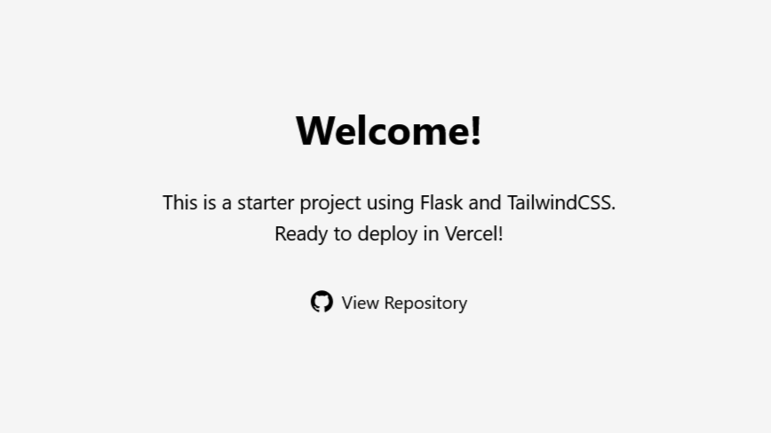

<!-- PROJECT SHIELDS -->

<!-- [![Contributors][contributors-shield]][contributors-url] -->

[![Forks][forks-shield]][forks-url]
[![Stargazers][stars-shield]][stars-url]
[![Issues][issues-shield]][issues-url]

<!-- PROJECT LOGO -->
<br />
<br />
<div align="center">
  <a href="https://github.com/odhyp/flask-tailwindcss-starter">
    
  </a>

<h3 align="center">Flask TailwindCSS Starter</h3>

  <p align="center">
    A starter project using Flask and TailwindCSS.
    <br />
    Ready to deploy in Vercel 🚀
    <br />
    <br />
    <a href="https://github.com/odhyp/flask-tailwindcss-starter"><strong>View Live »</strong></a>
    <br />
    <br />
    <a href="https://github.com/odhyp/flask-tailwindcss-starter/issues/new?labels=bug&template=bug-report---.md">Report Bug</a>
    &middot;
    <a href="https://github.com/odhyp/flask-tailwindcss-starter/issues/new?labels=enhancement&template=feature-request---.md">Request Feature</a>
  </p>
</div>

<!-- ABOUT THE PROJECT -->

## About The Project

[](image-url-here)

This project provides a boilerplate for building modern web applications with **Flask** and **TailwindCSS**. It simplifies the process of setting up a development environment and deploying to platforms like **Vercel**.

### Built With

- 
- 
- 

### Features:

- Integration of Flask and TailwindCSS
- Easy deployment with Vercel
- Starter templates for rapid development

<!-- GETTING STARTED -->

## Getting Started

To get a local copy up and running, follow these steps:

### Prerequisites

Ensure you have the following installed:

- [Python](https://www.python.org/downloads/) (at least v3.13)
- [Node.js](https://nodejs.org/en/download) (at least v23.6.0)
- [Vercel Account](https://vercel.com/signup) (optional for deployment)

### Installation

1. Clone the repository

   ```bash
   git clone https://github.com/odhyp/flask-tailwindcss-starter.git
   ```

2. Navigate to the project directory

   ```bash
   cd flask-tailwindcss-starter
   ```

3. Install Python dependencies

   ```bash
   pip install -r requirements.txt
   ```

4. Install the Node.js dependencies

   ```bash
   npm install
   ```

5. Run the Flask development server

   ```bash
   flask run
   ```

6. In a separate terminal, watch for changes to automatically rebuild TailwindCSS

   ```bash
   npm run dev
   ```

7. When development is complete, build the optimized TailwindCSS files

   ```bash
   npm run build
   ```

<!-- ROADMAP -->

## Roadmap

- [ ] More sample pages!

See the [open issues](https://github.com/odhyp/flask-tailwindcss-starter/issues) for a full list of proposed features (and known issues).

<!-- CONTRIBUTING -->

## Contributing

Contributions are what make the open source community such an amazing place to learn, inspire, and create. Any contributions you make are **greatly appreciated**.

If you have a suggestion that would make this better, please fork the repo and create a pull request. You can also simply open an issue with the tag "enhancement".
Don't forget to give the project a star! Thanks again!

1. Fork the Project
2. Create your Feature Branch (`git checkout -b feature/YourFeature`)
3. Commit your Changes (`git commit -m 'Add some YourFeature'`)
4. Push to the Branch (`git push origin feature/YourFeature`)
5. Open a Pull Request

### Top contributors:

<a href="https://github.com/odhyp/flask-tailwindcss-starter/graphs/contributors">
  
</a>

<!-- LICENSE -->

## License

Distributed under the MIT License. See `LICENSE` for more information.

<!-- ACKNOWLEDGMENTS -->

## Acknowledgements

- [Othneil Drew](https://github.com/othneildrew) for the [README.md Template](https://github.com/othneildrew/Best-README-Template)
- [Alexandre Sanlim](https://github.com/alexandresanlim) for the [README.md badges](https://github.com/alexandresanlim/Badges4-README.md-Profile)

<!-- MARKDOWN LINKS & IMAGES -->

[contributors-shield]: https://img.shields.io/github/contributors/odhyp/flask-tailwindcss-starter.svg?style=for-the-badge
[contributors-url]: https://github.com/odhyp/flask-tailwindcss-starter/graphs/contributors
[forks-shield]: https://img.shields.io/github/forks/odhyp/flask-tailwindcss-starter.svg?style=for-the-badge
[forks-url]: https://github.com/odhyp/flask-tailwindcss-starter/network/members
[stars-shield]: https://img.shields.io/github/stars/odhyp/flask-tailwindcss-starter.svg?style=for-the-badge
[stars-url]: https://github.com/odhyp/flask-tailwindcss-starter/stargazers
[issues-shield]: https://img.shields.io/github/issues/odhyp/flask-tailwindcss-starter.svg?style=for-the-badge
[issues-url]: https://github.com/odhyp/flask-tailwindcss-starter/issues
[license-shield]: https://img.shields.io/github/license/odhyp/flask-tailwindcss-starter.svg?style=for-the-badge
[license-url]: https://github.com/odhyp/flask-tailwindcss-starter/blob/master/LICENSE.txt
